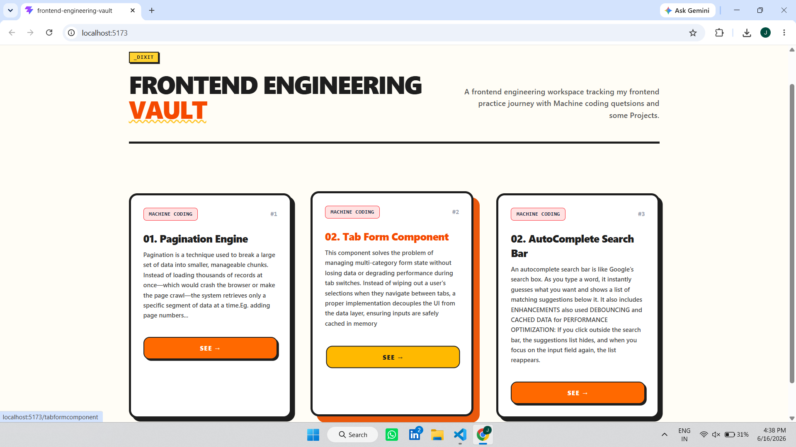
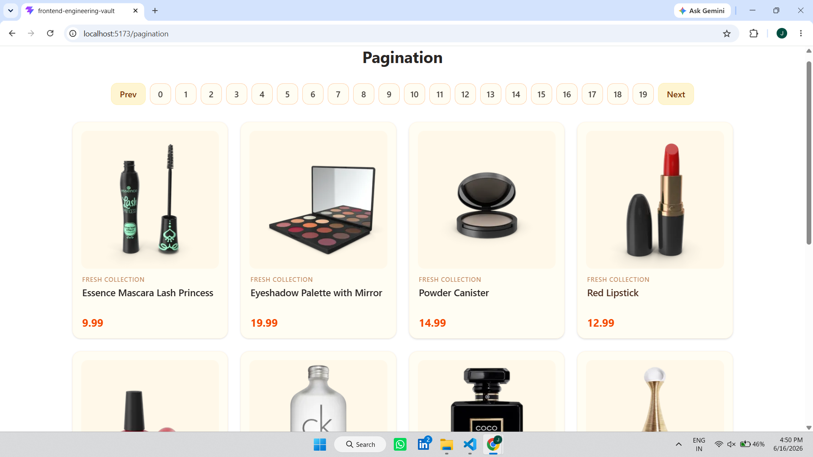

# ⚡ Frontend Engineering Vault

A centralized, interactive workspace featuring a curated collection of frontend machine coding challenges and UI components, built from scratch using **React**, **Tailwind CSS**, and **React Router**.




---

## 🚀 Project Overview

The project opens directly onto the **HubHome** dashboard—a clean, centralized landing page displaying all MACHINE CODING QUESTIONS components and PROJECCTS as interactive cards. Utilizing dynamic routing, users can click into any card to open and test individual components in isolation.

This vault is designed to demonstrate interview-ready frontend engineering principles: clean state management, render optimizations, and production-ready component architecture and performance optimization.

---

## 🧩 What's Inside the Vault?

### 📦 Machine Coding Questions Components
* **Pagination System:** Handles chunking large datasets with boundary limits (prev/next disabling) and loading states.
* **Tab Form Component:** Multi-category state management designed for profile interest settings without data-loss on tab switches.
* **Autocomplete Search Bar:** Features real-time suggestion filtering, click-outside-to-close handling, and focus/blur state sync.

### 🖼️ Component Interface Preview


---

## 🛠️ Core Engineering Problems Solved

* **Unified Dashboard Architecture:** A single-page HubHome entryway that maps configurations cleanly into route-driven standalone pages.
* **State Persistence & Isolation:** Prevents data loss when switching between complex view layers or nested forms.
* **Performance Control:** Eliminates unnecessary re-renders in heavy list/form components using optimized React patterns.
* **Modern Aesthetic UI:** Designed with clean, professional Tailwind styling, smooth transitions, and reactive click-states.

---

## ⚙️ Tech Stack

* **Core Library:** React.js
* **Styling:** Tailwind CSS
* **Routing:** React Router DOM (Single Page Application architecture)
* **Build Tool:** Vite 

---

## 🏃‍♂️ Run Locally

1. **Clone the repository:**
```bash
   git clone(https://github.com/jyotidxt/frontend-engineering-vault.git)