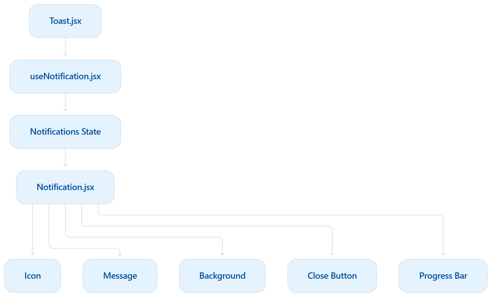

# Toast Notification — Low Level Design

## LLD Diagram

## Component Breakdown

### Toast.jsx
- Entry component that triggers notifications.
- Calls the custom notification hook.

### useNotification.jsx
- Manages the notifications state.
- Exposes methods like add and remove notification.

### Notification.jsx
- Renders a single toast notification.
- Receives the notification data as props.

## UI Elements

- Icon (Success / Error / Warning / Info)
- Title
- Custom Message
- Background based on notification type
- Close Button
- Progress Bar (Auto Dismiss)

## Data Flow

Toast.jsx → useNotification.jsx → Notification.jsx → Toast UI